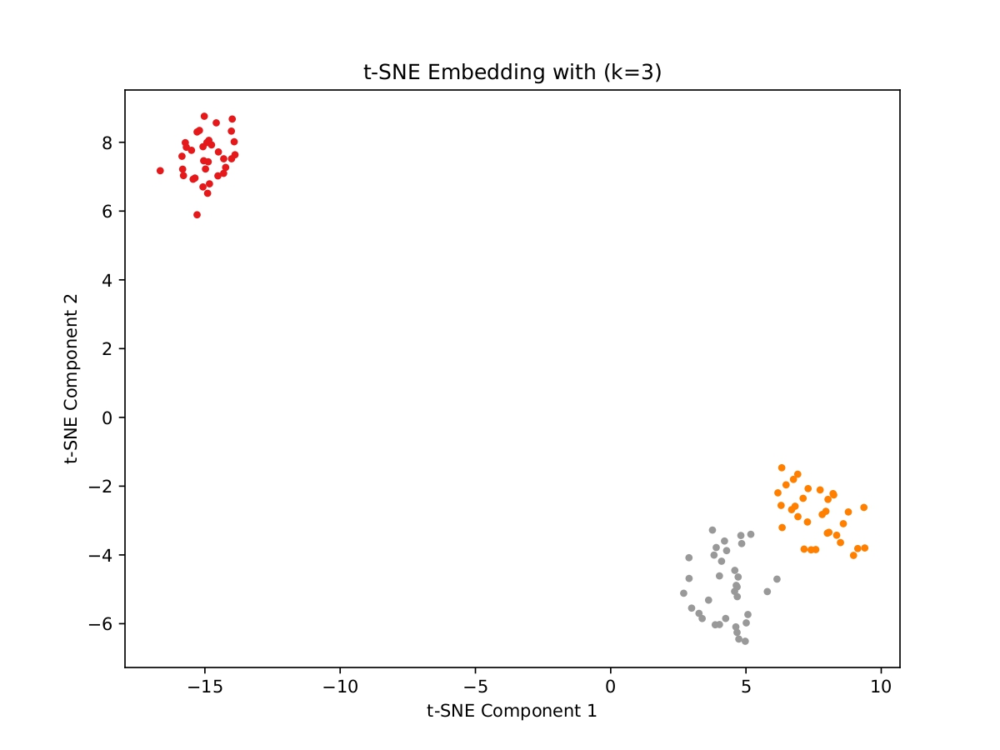

# QGCN

[](https://www.python.org/downloads/)
[](https://pennylane.ai/)
[](https://pytorch.org/)
[](https://pytorch-geometric.readthedocs.io/)
[](https://opensource.org/licenses/MIT)


## 📄 About the Paper
This Repository implements the algorithms and experiments described in our research paper:
> **[Edge-Local and Qubit-Efficient Quantum Graph Learning for the NISQ Era]** > *Authors: Armin Ahmadkhaniha,Jake Doliskani* 

The exact implementation used to generate the results in the paper (for **Cora** and **SNP** datasets) can be found in `examples/main.py`.

## 🛠 Installation & Quick Start

To replicate the experiments from the paper, follow these steps to set up the environment and run the main implementation.

### 1. Clone the Repository

```bash
git clone [https://github.com/ArminAhmadkhaniha/QGCNlib.git](https://github.com/ArminAhmadkhaniha/QGCNlib.git)
```

### 2. Install Dependencies

Ensure you have Python installed, then install the required packages:

```bash
pip install -r requirements.txt
```

### 3. Run the Paper Experiments
The direct implementation of the paper's methodology is located in `examples/main.py`. This script handles the data loading, model initialization, and training loop exactly as described in our research.

Note: The datasets (SNP and Cora) are pre-packaged within the repository. No manual download is required.

To run the experiment and generate the quantum embeddings:

```bash
python examples/main.py
```
You can toggle between datasets (SNP/Cora) by commenting/uncommenting the configuration lines inside `examples/main.py`.

### ⚠️ Important: Computational Cost & Hardware Requirements

The experiments in `examples/main.py` are configured to replicate the **exact results** from the paper. This involves running the **Pure, Full-Scale** versions of the **SNP** and **Cora** datasets.

**Please be aware:** Simulating quantum circuits on classical hardware is computationally intensive. The runtime and memory usage of `QGCNConv` depend heavily on three factors:
1.  **Qubit Count ($\lceil \log_2 d \rceil$):** The Hilbert space grows exponentially ($2^n$).
2.  **Edge Count ($|E|$):** Our **Latent Quantum Message Passing** requires calculating interactions for *every* edge in the graph.
3.  **RAM Availability:** Storing state vectors for large batched operations requires significant memory.

**Alternative Testing:**
* **Full Replication:** Running `main.py` on the full datasets is **time-consuming**. It processes all edges to ensure the highest fidelity message passing, as reported in the paper.
* **Rapid Validation:** To validate the code flow without waiting for the full simulation:
    1.  **Use the Micro-Benchmark:** See the **[Tutorial Section](#-tutorial-micro-benchmark-clustering)** below. This runs in seconds using a optimized small-scale graph.
    2.  **Use Subgraph Utilities:** We provide `qgcn_lib.utils.extract_experiment_subgraph`. This function allows you to extract connected subgraphs with reduced feature dimensions (e.g., 4-5 qubits), making the experiment manageable on standard laptops while preserving topological structure. Note that `qgcn_lib.utils.extract_experiment_subgraph` employs PCA for dimensionality reduction to minimize qubit usage. This compression can lead to information loss; therefore, results may not be directly comparable to the full-scale experiment.


## 📦 Package Overview: `qgcn_lib`

The code is organized as a modular Python package `qgcn_lib`, designed to be compatible with the **PyTorch Geometric (PyG)** ecosystem using **PennyLane**.

### 1. Neural Network Modules (`qgcn_lib.nn`)
This module contains the core quantum layers.
* **`QGCNConv`**: The primary convolution layer. It implements the architecture using:
    * *Quantum Feature Extraction:* Amplitude Embedding + VQC (Strongly Entangling Layers).
    * *Latent Quantum Message Passing:* Structural aggregation in the logarithmic qubit space.
* **`HybridQGCNConv`**: A **Semi-Quantum** variant graph learning designed for ablation studies.
    * *Quantum Feature Extraction:* Uses the same encoding as QGCN.
    * *Classical Aggregation:* Replaces the quantum message passing with standard classical aggregation. 
* **`SummaryMLP`**: A readout network used in Deep Graph Infomax (DGI) to compute the global graph summary vector $\vec{s}$ for mutual information maximization.

### 2. Datasets (`qgcn_lib.datasets`)
Standardized data loaders that mirror `torch_geometric.datasets`.
* **`MicroBenchmark`**: A synthetic generator for rapid testing. Creates random graphs with controllable clusters and features to verify algorithmic logic without heavy compute.
* **`ExperimentDataset`**: A wrapper for loading real-world research datasets (e.g., **Cora**, **SNP**) saved as `.pt` files, ensuring consistent formatting for the model.

### 3. Research Utilities (`qgcn_lib.utils`)
A comprehensive toolkit for the entire experimental lifecycle:
* **Corruption Functions:** `feature_shuffling_corruption` implements the negative sampling strategy required for unsupervised DGI training.
* **Evaluation:** Functions like `perform_kmeans_clustering` and `calculate_kmeans_inertia` allow for immediate assessment of latent space quality.
* **Visualization:** Tools to generate **t-SNE** plots (`visualize_embedding`) and **Elbow Method** curves to analyze cluster separation.
* **Reproducibility:** `set_all_seeds` ensures that all quantum and classical random processes are deterministic for valid comparisons.

## 🎓 Tutorial: Micro-Benchmark Clustering

This tutorial demonstrates the **QGCN** workflow on a synthetic dataset. This allows for rapid validation of the quantum circuit logic without the heavy computational overhead of the full Cora/SNP experiments. 

**Note:** For each code snippet, we include relevant imports to familiarize users with our package."

### 1. Data Generation
We use the `MicroBenchmark` loader from `qgcn_lib.datasets`. This utility generates a random graph with distinct community structures, designed specifically to fit within a small quantum simulation budget.


```python
import torch
from qgcn_lib.datasets import MicroBenchmark

# Generate a synthetic graph
# - n_nodes=100: Small enough for rapid CPU simulation.
# - d_feat=16: Chosen specifically because log2(16) = 4 qubits.
# - n_clusters=3: Ground truth communities for NMI evaluation.
dataset = MicroBenchmark(root='./data/micro', n_nodes=100, d_feat=16, n_clusters=3)
data = dataset[0]


print(f"Graph Created: {data.num_nodes} Nodes, {data.num_features} Features")
# Output: Graph Created: 100 Nodes, 16 Features
device = torch.device('cuda' if torch.cuda.is_available() else 'cpu')
```

### 2. Model Initialization & Training Strategy


#### A. Dynamic Qubit Allocation
Instead of manually tuning the latent dimension, we calculate the theoretical minimum number of qubits required to represent the input features $d$. 

```python
import math
import torch
from qgcn_lib.nn import QGCNConv, SummaryMLP
from qgcn_lib.utils import set_all_seeds, feature_shuffling_corruption
from torch_geometric.nn import DeepGraphInfomax
import tqdm


# Automatic Qubit Calculation
# For our micro-benchmark (d=16), this results in exactly 4 qubits.
in_channels = data.x.size(1)
hidden_channels = math.ceil(math.log2(in_channels))

print(f"--> Feature Dimension (d): {in_channels}")
print(f"--> Quantum Latent Space: {hidden_channels} Qubits")

```

#### B. Train Function

```python
def train_quantum_dgi(model, features, edge_index, epochs):
    """
    Training loop with Group-Wise Learning Rates.
    """
    model.to(device)
    features = features.to(device)
    edge_index = edge_index.to(device)

    param_groups = []
    
   
    if hasattr(model.encoder, 'qc'):
        param_groups.append({'params': model.encoder.qc.parameters(), 'lr': 0.01})
    if hasattr(model.encoder, 'local_mp'):
        param_groups.append({'params': model.encoder.local_mp.parameters(), 'lr': 0.01})

    classical_params = []
    if hasattr(model.encoder, 'q_proj'): classical_params.extend(model.encoder.q_proj.parameters())
    if hasattr(model.encoder, 'bias'): classical_params.append(model.encoder.bias)
    if hasattr(model.encoder, 'prelu'): classical_params.extend(model.encoder.prelu.parameters())
    if hasattr(model, 'summary'): classical_params.extend(model.summary.parameters())
    
    param_groups.append({'params': classical_params, 'lr': 0.001})

    # Initialize Optimizer with the grouped parameters
    optimizer = torch.optim.Adam(param_groups)

    # Standard DGI Training Loop
    print(f"--> Starting Training for {epochs} epochs...")
    for epoch in tqdm.tqdm(range(epochs), desc="Training"):
        model.train()
        optimizer.zero_grad()
        
        # Forward pass returns: Real Embeddings, Corrupted Embeddings, Global Summary
        pos_z, neg_z, summary = model(features, edge_index)
        
        loss = model.loss(pos_z, neg_z, summary)
        loss.backward()
        optimizer.step()
        
    return model
```
#### C. Experiment Execution

The `run_experiment` function encapsulates the entire pipeline: initialization, model construction, and execution. It demonstrates how to wrap our custom quantum encoder within the PyTorch Geometric ecosystem.

```python
def run_experiment(features, idx_edge):
    # 1. Reproducibility
    # Essential for quantum simulations where measurement outcomes can be stochastic.
    set_all_seeds(123)
    
    num_nodes = features.size(0)
    
    # 2. Initialize the Quantum Encoder
    # - hidden_channels: Calculated dynamically (log2 d)
    # - q_depth=3: Depth of the Variational Quantum Circuit (VQC) layers
    encoder = QGCNConv(
        in_channels=features.size(1), 
        points=num_nodes, 
        hidden_channels=hidden_channels, 
        q_depth=3 
    )
    
    # 3. Initialize the Global Summary Network
    summary = SummaryMLP(hidden_channels)
    
    # 4. Construct the DGI Model
    # We use 'feature_shuffling_corruption' to generate negative samples.
    # The model learns by maximizing Mutual Information between:
    #   - Positive: Real local patches + Global summary
    #   - Negative: Shuffled features + Global summary
    model = DeepGraphInfomax(
        hidden_channels=hidden_channels,
        encoder=encoder,
        summary=summary,
        corruption=feature_shuffling_corruption
    )
    
    # 5. Execute Training
    # Uses the differential learning rate strategy defined earlier.
    model = train_quantum_dgi(model, features, idx_edge, epochs=50)
    
    # 6. Extract Embeddings (Z)
    model.eval()
    with torch.no_grad():
        z, _, _ = model(features, idx_edge)
        
    return z

z = run_experiment(data.x, data.edge_index)
```

### 3. Evaluation & Visualization

Since **QGCN** is an unsupervised model (trained via DGI), we evaluate the quality of the learned embeddings ($Z$) by checking if they naturally form clusters that match the ground truth communities.

We provide built-in utilities in `qgcn_lib.utils` to automate this process:

```python
from qgcn_lib.utils import perform_kmeans_clustering, visualize_embedding
from sklearn.metrics import normalized_mutual_info_score


# 1. Cluster Analysis (K-Means)
# We ask K-Means to find 3 clusters in the 4-dimensional quantum latent space
labels, z_np, score = perform_kmeans_clustering(z, 3)

# 2. Quantitative Metric (NMI)
# We compare the learned clusters against the true graph communities
# NMI = 1.0 means perfect correlation; NMI = 0.0 means random.
nmi = normalized_mutual_info_score(data.y.cpu().numpy(), labels)

print(f"--> Silhouette Score: {score:.4f}")
print(f"--> NMI Score (Cluster Quality): {nmi:.4f}")

# 3. Visualization (t-SNE)
# This generates a 2D projection of the quantum embeddings
visualize_embedding(z_np, labels, score, 3)
```

#### 📊 Resulting Embedding

The table below summarizes the clustering performance of the QGCN on the synthetic dataset. 

| Metric | Score | Interpretation |
| :--- | :--- | :--- |
| **Silhouette Score** | **0.7672** | Indicates that the clusters are dense and well-separated in the quantum latent space. |
| **NMI (Normalized Mutual Info)** | **0.7103** | Demonstrates a high correlation between the unsupervised quantum clusters and the ground truth classes. |

**Key Takeaway:** The high NMI score confirms that the quantum circuit successfully encoded the graph's topological structure without any label supervision. Moreover, below is the t-SNE visualization of the learned latent space ($Z$) for the 100-node Micro-Benchmark graph.

**Key Observation:** Despite compressing the 16 input features into just **4 qubits**, the QGCN successfully preserves the graph's community structure. The clear separation between the three clusters (colored by K-Means assignment) demonstrates that the quantum circuit has learned meaningful topological representations without any supervision.


*(Figure: 2D t-SNE projection of the 4-qubit quantum embeddings. Colors represent the clusters assigned by K-Means, which align strongly with the ground truth communities.)*
